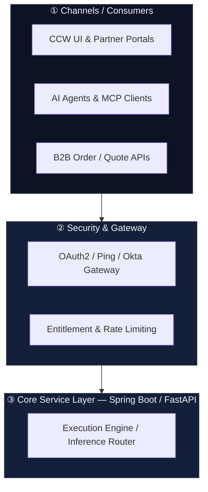
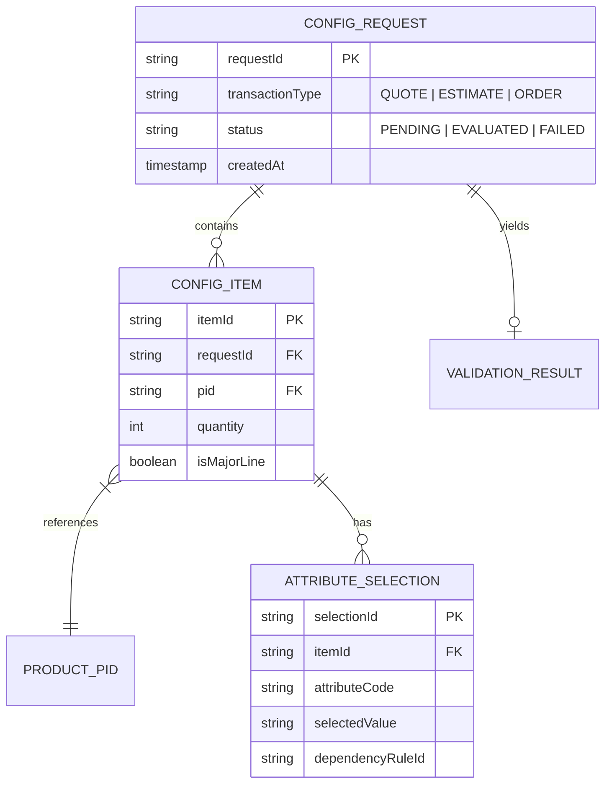

# Instructions

When triggered with `/explain-code`, execute the multi-phase analysis and explanation pipeline according to the targeted user scope. Generate a suite of **logically separated Markdown files**, creating a master parent document (`EXPLAIN_PARENT.md`) that links to all dedicated child documents.

---

## Prerequisites: MCP Server Integrations

To enable deep cross-repository analysis, architectural modeling, and organizational alignment, leverage the following MCP servers across all phases:

1. **Atlassian MCP Server** (Jira & Confluence):
   ```bash
   npx add-mcp https://mcp.atlassian.com/v1/mcp --transport http --name atlassian
   ```
   * **Usage:** Fetch user stories, acceptance criteria, architectural decision records (ADRs), Confluence tech blueprints, PRDs, and release notes to ground code analysis in business context.

2. **IcePanel MCP Server** (C4 Architecture & Data Modeling):
   ```bash
   npx add-mcp @icepanel/mcp-server --name icepanel --env 'ICEPANEL_API_KEY=${ICEPANEL_API_KEY}' --env 'ICEPANEL_ORGANIZATION_ID=${ICEPANEL_ORGANIZATION_ID}' --args 'API_KEY=${ICEPANEL_API_KEY}' --args 'ORGANIZATION_ID=${ICEPANEL_ORGANIZATION_ID}'
   ```
   * **Usage:** Create, query, and sync C4-model domain objects, system contexts, container diagrams, component relationships, and visual data models.

3. **GitHub MCP Server** (External Repositories & Shared Libraries):
   ```bash
   npx add-mcp https://api.githubcopilot.com/mcp/ --transport http --name github
   ```
   * **Usage:** Inspect external dependencies, cross-repo contracts, starter kits (e.g., Spring Boot starters), shared models, and upstream/downstream service code outside the local repository.

---

## Phase 1: Determine Analysis Scope

Analyze the user's prompt and active workspace to establish the target boundary:

* **Scope A (Single API / Endpoint):** Trace request/response flow for the targeted route, its controllers, services, DTOs, and persistence layer.
* **Scope B (Single Flow / Feature):** Trace execution across multiple components for a specific functional unit (e.g., "Checkout Flow" or "BOM Recommendation Generation").
* **Scope C (Single Scenario / Edge Case):** Trace a specific conditional execution path (e.g., "Payment Failure & Retry Strategy" or "Rule Validation Fallback").
* **Scope D (Entire Project / Repository & Cross-Service):** System-wide sweep across all modules, routes, data flows, and external service contracts via GitHub/Atlassian MCP.

---

## Phase 2: Generate Multi-Tier Markdown Documentation Suite

Generate documentation structured into a cohesive multi-level file hierarchy:

```
docs/explain/ (or target directory)
├── EXPLAIN_PARENT.md          # Master Index & Executive Overview (links to all child documents)
├── EXPLAIN_HIGH_LEVEL.md       # High-Level Architecture, Design Principles & Dependencies
├── EXPLAIN_MID_LEVEL.md        # Component Design, State Management & Service Orchestration
├── EXPLAIN_LOW_LEVEL.md        # Method-by-Method Logic, Algorithmic Rules & Invariants
├── EXPLAIN_FLOW_DIAGRAMS.md    # Nested Mermaid Container Diagrams & IcePanel C4 Models
├── EXPLAIN_DATA_MODEL.md       # OpenSpec Domain Data Models & Entity-Relationship Diagrams
└── EXPLAIN_OPENAPI.md          # OpenAPI 3.1 Spec & Cognitive Attribute Dependency Matrices
```

### Document Detail Specifications:

1. **High-Level Overview (`EXPLAIN_HIGH_LEVEL.md`):**  
   * System Architecture, design principles, and business drivers (citing Jira/Confluence context).
   * External dependencies and upstream/downstream integrations (citing external repos via GitHub MCP).
   * Macro data lifecycle and key domain boundaries.

2. **Medium-Level Component Design (`EXPLAIN_MID_LEVEL.md`):**  
   * Class/Component interaction models and data flow contracts.  
   * State management, thread/reactive models (e.g., Spring WebFlux, async event loops), and transactional boundaries.

3. **Low-Level Code Walkthrough (`EXPLAIN_LOW_LEVEL.md`):**  
   * Deep dive into exact methods, algorithm logic, validation routines, and variable states.  
   * Exception handling, retry mechanisms, fallbacks, and side-effects.

---

## Phase 3: Generate Nested Box Flow Diagrams (Mermaid & IcePanel)

Generate visual architecture and execution diagrams matching the **nested container hierarchy style** (`EXPLAIN_FLOW_DIAGRAMS.md`).

### Mermaid Styling Standard:
* Use `subgraph` with numbered circle headers (e.g., `subgraph S1 ["① Channels / Consumers"]`).
* Use line-breaks (`<br/>`) for descriptive list items inside nodes.
* Connect containers or inner nodes sequentially from top to bottom (`TD` or `TB` direction).



### IcePanel Visual Model Integration:
* When visual architecture modeling is requested or beneficial, use the **IcePanel MCP Server** to define and sync System Context, Container boundaries, and Component linkages into IcePanel.

---

## Phase 4: Domain Data Modeling for OpenSpec Stores (`EXPLAIN_DATA_MODEL.md`)

Generate a formal, comprehensive **Domain Data Model** of the functional area. The output must be rigorous enough to be ingested directly by **OpenSpec stores** as authoritative, context-aware functional schemas.

### 1. OpenSpec-Ready Entity Schema Specification:
For every core domain entity, define:
* **Entity Identity & Bounded Context:** Entity name, primary keys, and owning microservice/module.
* **Fields & Type System:** Full JSON schema / type definitions, defaults, and nullability.
* **Domain Invariants & Business Rules:** Hard constraints (e.g., `totalPrice >= sum(itemPrice)`).
* **State Lifecycle & Transitions:** Allowed state progression (e.g., `DRAFT -> VALIDATED -> COMMITTED`).

### 2. Entity-Relationship (ER) Diagram (Mermaid):



### 3. OpenSpec Context Data Model Table:

| Entity | Attribute | Type | Multiplicity | Invariant / Validation Rule | OpenSpec Context Impact |
| :--- | :--- | :--- | :--- | :--- | :--- |
| `ConfigRequest` | `requestId` | `UUID` | `1..1` | Unique transaction trace identifier | Keys session-level rule cache |
| `ConfigRequest` | `items` | `List<Item>` | `1..*` | Must contain at least 1 primary offer PID | Drives root configuration tree traversal |
| `ConfigItem` | `ruleOverrides`| `Map<String, Any>` | `0..1` | Allowed only for authorized roles (RBAC) | Triggers custom constraint solver path |

---

## Phase 5: OpenAPI / Swagger Breakdown with Deep Attribute Dependencies (`EXPLAIN_OPENAPI.md`)

For any analyzed API routes, generate a structured **OpenAPI 3.1 specification** accompanied by an **Attribute Impact & Cognitive Dependency Analysis Table**.

### Attribute Deep-Dive Requirements:
For every schema field/attribute, explain:
1. **Impact & Usage:** Exact runtime role, business logic impact, and downstream side effects.
2. **Conditional Dependencies:** How this attribute relies on or alters the state of other attributes (e.g., *"If `paymentMethod` is `'CREDIT_CARD'`, `stripeToken` becomes mandatory"*).
3. **Validation Rules:** Business logic constraints beyond simple data types.

### Schema Explanation Table Format:

| Attribute | Type | Required | Business Impact & Usage | Dependencies & Cognitive Rules |
| :--- | :--- | :--- | :--- | :--- |
| `tierCode` | `string` | Conditional | Triggers pricing tier evaluation engine. | **Requires:** `accountStatus == 'ACTIVE'`. **Overrides:** `discountRate` if tier is `'PLATINUM'`. |
| `region` | `string` | Yes | Determines regional database router & tax calculation module. | **Valid Values:** Restricted based on user's `billingCountry`. |

---

## Phase 6: Master Parent Navigation (`EXPLAIN_PARENT.md`)

The parent document (`EXPLAIN_PARENT.md`) must clearly describe the purpose of each child document and provide direct links to them for navigation:

```markdown
# Explanation & Architecture Overview

Comprehensive multi-level system specification, architectural diagrams, OpenSpec data models, and API breakdown.

## Documentation Index

| Tier | Document | Focus Area |
| :--- | :--- | :--- |
| 📘 **High-Level** | [EXPLAIN_HIGH_LEVEL.md](EXPLAIN_HIGH_LEVEL.md) | Macro Architecture, Bounded Contexts & Dependencies |
| ⚙️ **Medium-Level** | [EXPLAIN_MID_LEVEL.md](EXPLAIN_MID_LEVEL.md) | Component Orchestration, Concurrency & State Management |
| 🔍 **Low-Level** | [EXPLAIN_LOW_LEVEL.md](EXPLAIN_LOW_LEVEL.md) | Method Logic, Algorithms, Invariants & Error Handling |
| 📊 **Diagrams** | [EXPLAIN_FLOW_DIAGRAMS.md](EXPLAIN_FLOW_DIAGRAMS.md) | Nested Mermaid Container Diagrams & IcePanel C4 Models |
| 🗄️ **Data Model** | [EXPLAIN_DATA_MODEL.md](EXPLAIN_DATA_MODEL.md) | OpenSpec Entity Schemas, Invariants & ER Diagrams |
| 🔌 **API Spec** | [EXPLAIN_OPENAPI.md](EXPLAIN_OPENAPI.md) | OpenAPI 3.1 Contract & Cognitive Attribute Dependencies |
```

---

## User Context & Execution
Target Request:
${input}