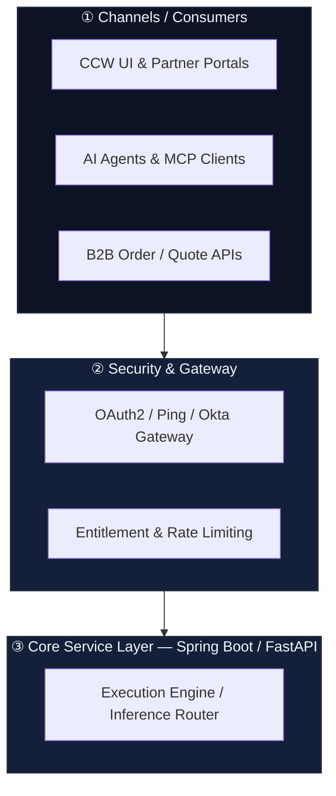
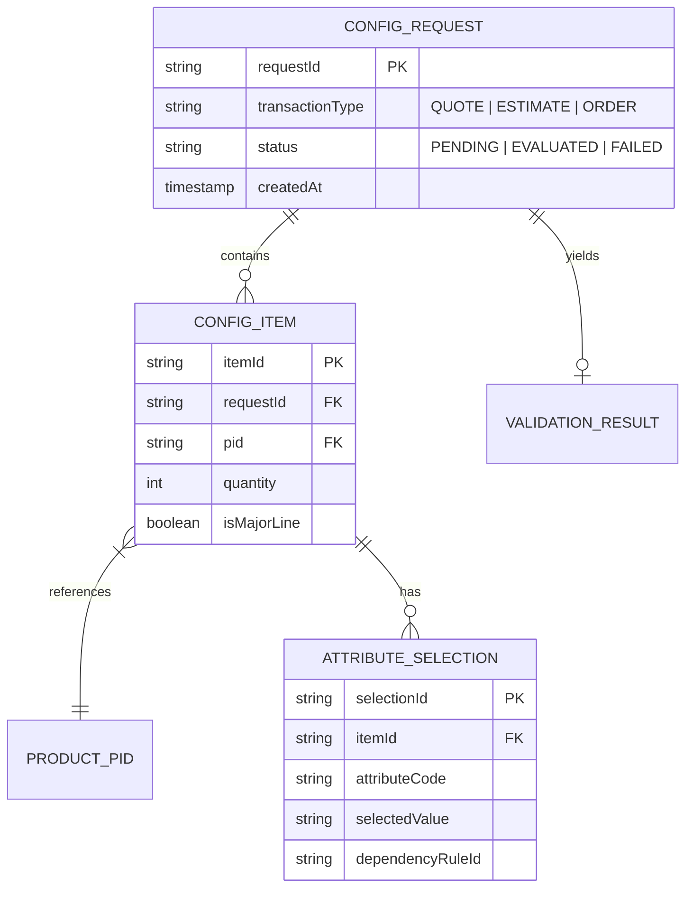

# Instructions

When triggered with `/explain-code`, execute the multi-phase analysis and explanation pipeline according to the targeted user scope, leveraging the configured MCP servers across all phases.

---

## Prerequisites: MCP Server Integrations

To enable deep cross-repository analysis, architectural modeling, and organizational alignment, leverage the following MCP servers when configured in your environment:

1. **Atlassian MCP Server** (Jira & Confluence):
   ```bash
   npx add-mcp https://mcp.atlassian.com/v1/mcp --transport http --name atlassian
   ```
   * **Usage:** Fetch user stories, acceptance criteria, architectural decision records (ADRs), Confluence tech blueprints, PRDs, and release notes to ground code analysis in business context.

2. **IcePanel MCP Server** (C4 Architecture & Data Modeling):
   ```bash
   npx add-mcp @icepanel/mcp-server --name icepanel --env 'ICEPANEL_API_KEY=${ICEPANEL_API_KEY}' --env 'ICEPANEL_ORGANIZATION_ID=${ICEPANEL_ORGANIZATION_ID}' --args 'API_KEY=${ICEPANEL_API_KEY}' --args 'ORGANIZATION_ID=${ICEPANEL_ORGANIZATION_ID}'
   ```
   * **Usage:** Create, query, and sync C4-model domain objects, system contexts, container diagrams, component relationships, and visual data models.

3. **GitHub MCP Server** (External Repositories & Shared Libraries):
   ```bash
   npx add-mcp https://api.githubcopilot.com/mcp/ --transport http --name github
   ```
   * **Usage:** Inspect external dependencies, cross-repo contracts, starter kits (e.g., Spring Boot starters), shared models, and upstream/downstream service code outside the local repository.

---

## Phase 1: Determine Analysis Scope

Analyze the user's prompt and active workspace to establish the target boundary:

* **Scope A (Single API / Endpoint):** Trace request/response flow for the targeted route, controllers, services, DTOs, and persistence layer.
* **Scope B (Single Flow / Feature):** Trace execution across multiple components for a specific functional unit (e.g., "BOM Recommendation Generation").
* **Scope C (Single Scenario / Edge Case):** Trace a specific conditional execution path (e.g., "Rule Validation Failure & Fallback Resolution").
* **Scope D (Entire Project / Cross-Service Architecture):** System-wide sweep across all modules, routes, data flows, and external service contracts via GitHub/Atlassian MCP.

---

## Phase 2: Generate Multi-Tier Markdown Documentation

Generate documentation structured into a cohesive multi-level hierarchy:

1. **Parent Document (`EXPLAIN_PARENT.md`):**  
   * High-level executive overview of the system/feature.  
   * Navigation index with direct links to all child documents:  
     - [High-Level Overview](EXPLAIN_HIGH_LEVEL.md)  
     - [Medium-Level Component Design](EXPLAIN_MID_LEVEL.md)  
     - [Low-Level Code Walkthrough](EXPLAIN_LOW_LEVEL.md)  
     - [Nested Box Flow Diagrams](EXPLAIN_FLOW_DIAGRAMS.md)  
     - [Domain Data Model & OpenSpec Context](EXPLAIN_DATA_MODEL.md)  
     - [OpenAPI / Swagger Breakdown](EXPLAIN_OPENAPI.md)  

2. **High-Level Overview (`EXPLAIN_HIGH_LEVEL.md`):**  
   * System Architecture, business drivers (citing Jira/Confluence if applicable), and external dependencies (citing external repos via GitHub MCP).  
   * Macro data lifecycle, bounded contexts, and high-level boundaries.

3. **Medium-Level Component Design (`EXPLAIN_MID_LEVEL.md`):**  
   * Component interaction models, event contracts, and service orchestration.  
   * State management, thread/reactive models (e.g., WebFlux), and transaction boundaries.

4. **Low-Level Code Walkthrough (`EXPLAIN_LOW_LEVEL.md`):**  
   * Deep dive into exact methods, algorithmic logic, validation routines, and variable state mutations.  
   * Exception hierarchies, retry mechanisms, and side effects.

---

## Phase 3: Generate Nested Box Flow Diagrams (Mermaid & IcePanel)

Generate visual execution diagrams using nested container hierarchies.

### 1. Mermaid Flow Diagram Standard
* Use `subgraph` blocks with numbered circle headers (e.g., `subgraph S1 ["① Channels / Consumers"]`).
* Include descriptive node labels with `<br/>` formatting for multi-line context.
* Render top-to-bottom (`TD`) or left-to-right (`LR`) data flows.



### 2. IcePanel Visual Model Integration
* When visual architecture modeling is requested or beneficial, use the **IcePanel MCP Server** to:
  * Export/sync C4 model components into the organizational IcePanel landscape.
  * Define System Context, Container boundaries, and Component connections.

---

## Phase 4: Domain Data Modeling for OpenSpec Stores (`EXPLAIN_DATA_MODEL.md`)

Generate a formal, comprehensive **Domain Data Model** of the functional area. The output must be rigorous enough to be ingested directly by **OpenSpec stores** as authoritative, context-aware functional schemas.

### 1. OpenSpec-Ready Entity Schema Specification
For every core domain entity, define:
* **Entity Identity & Bounded Context:** Entity name, primary keys, and owning microservice/module.
* **Fields & Type System:** Full JSON schema / type definitions, defaults, and nullability.
* **Domain Invariants & Business Rules:** Hard constraints (e.g., `totalPrice >= sum(itemPrice)`).
* **State Lifecycle & Transitions:** Allowed state progression (e.g., `DRAFT -> VALIDATED -> COMMITTED`).

### 2. Entity-Relationship (ER) Diagram (Mermaid)



### 3. OpenSpec Context Data Model Table

| Entity | Attribute | Type | Multiplicity | Invariant / Validation Rule | OpenSpec Context Impact |
| :--- | :--- | :--- | :--- | :--- | :--- |
| `ConfigRequest` | `requestId` | `UUID` | `1..1` | Unique transaction trace identifier | Keys session-level rule cache |
| `ConfigRequest` | `items` | `List<Item>` | `1..*` | Must contain at least 1 primary offer PID | Drives root configuration tree traversal |
| `ConfigItem` | `ruleOverrides`| `Map<String, Any>` | `0..1` | Allowed only for authorized roles (RBAC) | Triggers custom constraint solver path |

---

## Phase 5: OpenAPI / Swagger Breakdown with Cognitive Attribute Dependencies

For all exposed endpoints, generate the OpenAPI 3.1 specification accompanied by an **Attribute Impact & Dependency Analysis Table**.

### Attribute Deep-Dive Breakdown

| Attribute | Type | Required | Business Impact & Execution Path | Cognitive Rules & Dependencies |
| :--- | :--- | :--- | :--- | :--- |
| `targetArchitecture` | `string` | Yes | Directs inference router to specific rule tree | **Requires:** Valid Cisco BU architecture code. |
| `enableAiResolution` | `boolean` | No (default `true`) | Toggles ML constraint resolution vs strict heuristic | **Overrides:** Fallback timeout when set to `false`. |

---

## Phase 6: Summary & Master Navigation (`EXPLAIN_PARENT.md`)

Produce the master index document unifying all generated tiers:

```markdown
# Explanation & Architecture Overview

Comprehensive multi-level system specification, architectural diagrams, OpenSpec data models, and API breakdown.

## Available Documentation

- 📘 [High-Level Architecture & Overview](EXPLAIN_HIGH_LEVEL.md) — System boundaries, external dependencies, and business context.
- ⚙️ [Medium-Level Component Design](EXPLAIN_MID_LEVEL.md) — Component interactions, state machines, and concurrency models.
- 🔍 [Low-Level Code Walkthrough](EXPLAIN_LOW_LEVEL.md) — Method-by-method logic, algorithms, and exception handling.
- 📊 [Nested Box Flow Diagrams](EXPLAIN_FLOW_DIAGRAMS.md) — Visual execution flow and C4 system context (Mermaid & IcePanel).
- 🗄️ [Domain Data Model & OpenSpec Context](EXPLAIN_DATA_MODEL.md) — Complete entity relationships, state machines, and OpenSpec store models.
- 🔌 [OpenAPI & Attribute Dependency Breakdown](EXPLAIN_OPENAPI.md) — API contract with deep cognitive attribute validation rules.
```

---

## User Context & Execution
Target Request:
${input}